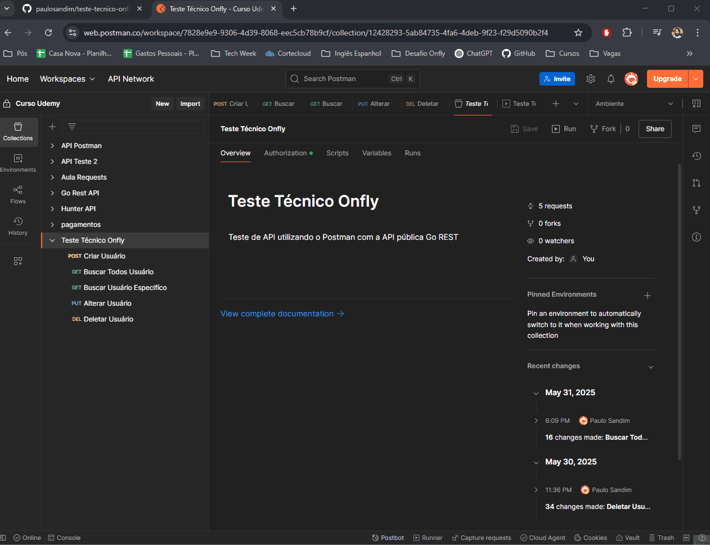

# Teste Técnico Onfly - Testes Automatizados

Este projeto contém a automação de testes end-to-end para o e-commerce público [Swag Labs](https://www.saucedemo.com/).

Também foram criados testes automatizados para validar a API pública [Go REST](https://gorest.co.in/).

Ambos como parte de um Teste Técnico para vaga de QA Sênior na empresa **Onfly**.

## Funcionalidades Testadas na Web

- Login com sucesso
- Login com falha (credenciais inválidas)
- Validação de campos obrigatórios (username e password)
- Visualização de produto
- Adição de itens no carrinho
- Remoção de itens no carrinho
- Fluxo completo de compra

## Funcionalidades Testadas na API

- Criação de usuários
- Busca por todos os usuários
- Busca por um usuário específico
- Edição de um usuário específico
- Exclusão de usuário específico

## Casos de Testes 

- Os Casos de teste estão na pasta [features](./features), no formato Gherkin e prontos para serem usados com Cucumber.

## Tecnologias Utilizadas

- [Cypress 14+](https://www.cypress.io/)
- [Node.js 22+](https://nodejs.org/en/download)
- [Docker](https://www.docker.com/)
- [Docker Compose](https://docs.docker.com/compose/)
- [Postman](https://www.postman.com/)
- [Newman CLI](https://github.com/postmanlabs/newman)

## Instalação e execução

### Requisitos

- [Docker](https://www.docker.com/)
- [Docker Compose](https://docs.docker.com/compose/)

### Clone o repositório:

```bash
git clone git@github.com:paulosandim/teste-tecnico-onfly.git
```

## Build e execução completa

### Executar bateria completa de E2E + API (Cypress e Newman):

```bash
docker-compose up --build
```

### Executar apenas Cypress:
```bash
docker-compose run --build cypress
```

### Executar apenas Newman:
```bash
docker-compose run --rm newman
```

## Integração Contínua com GitHub Actions

Este projeto está integrado ao **GitHub Actions** para rodar testes automaticamente a cada _push_ ou _pull request_.

## Evidências dos Testes

### Execução Completa E2E + API (Cypress e Newman):

### Testes do Fluxo de Login:


### Testes do Fluxo de Compra:


### Testes Cypress via Headless:


### Testes de API via Postman:


